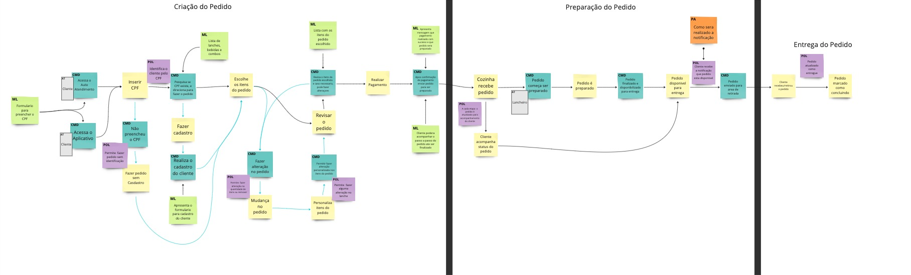

# Fast Food

The fast-food restaurant management system aims to:

- **Manage customers:** register, view, edit and delete customers.
- **Manage products:** register, view, edit and delete products.
- **Manage orders:** register, view, edit and delete orders.
- **Generate checkout for payment:** with order information for the customer to complete payment.

### Process flow of how fast food should work

# Getting Started

### Technologies used

**Project developed in Kotlin**

- JDK 17
- Kotlin 1.9
- Maven 3.9.5
- Spring Boot 3.2.1
- Data Base MongoDB 7

### Reference Documentation
Some of the technologies used in the project:

* [Official Apache Maven documentation](https://maven.apache.org/guides/index.html)
* [Spring Boot Maven Plugin Reference Guide](https://docs.spring.io/spring-boot/docs/3.2.1/maven-plugin/reference/html/)
* [Create an OCI image](https://docs.spring.io/spring-boot/docs/3.2.1/maven-plugin/reference/html/#build-image)
* [Spring Web](https://docs.spring.io/spring-boot/docs/3.2.1/reference/htmlsingle/index.html#web)
* [Spring Data JPA](https://docs.spring.io/spring-boot/docs/3.2.1/reference/htmlsingle/index.html#data.sql.jpa-and-spring-data)
* [Spring Data MongoDB](https://docs.spring.io/spring-boot/docs/3.2.1/reference/htmlsingle/index.html#data.nosql.mongodb)
* [Validation](https://docs.spring.io/spring-boot/docs/3.2.1/reference/htmlsingle/index.html#io.validation)

## Run the project

The application is configured to run on port **8080** and the database runs on port **27017**

#### Run of project by Script

A script was created where steps are taken to run the application automatically
This way, when executing the script, the application is executed
---

**Run the command:** 

``./start.sh``

This script will:
- build the application
- create the docker image
- run the container

 **Observation** 

If there is a problem with permission to run the script, you can execute the command below

`` sudo chmod +x filename.sh ``

This will give the necessary permissions to run the file.

Another option may be to run the commands manually as described below

---

#### Run of project Manual
``mvn package``

#### Generate imagem docker
`` docker build -t fastfood:lasted . ``

#### Start project services and dependencies
When running the docker composer file, the mongodb database is started,
already including some masses of data in the base for product and customer collections

``docker-compose -f docker-compose.yml up -d``

After starting the containers, the application will run on port 8080

And it can be accessed through the address

http://localhost:8080/swagger-ui/index.html

